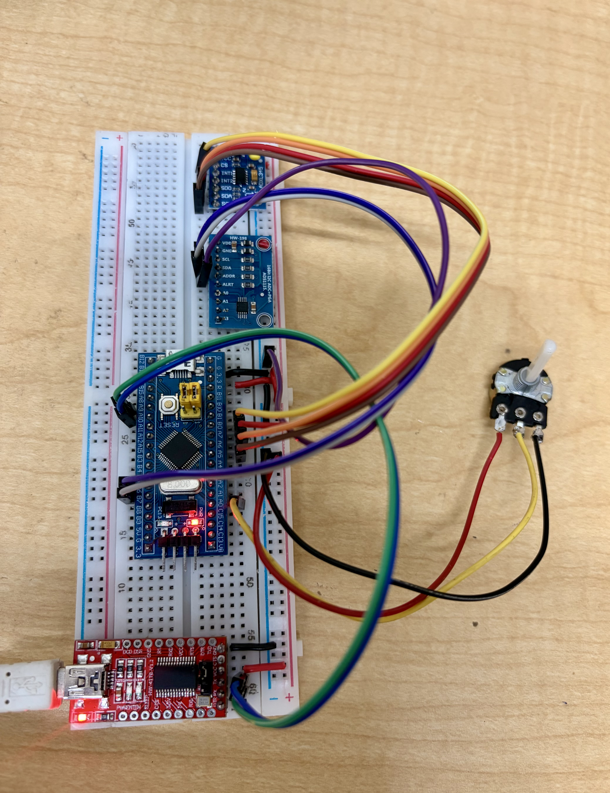
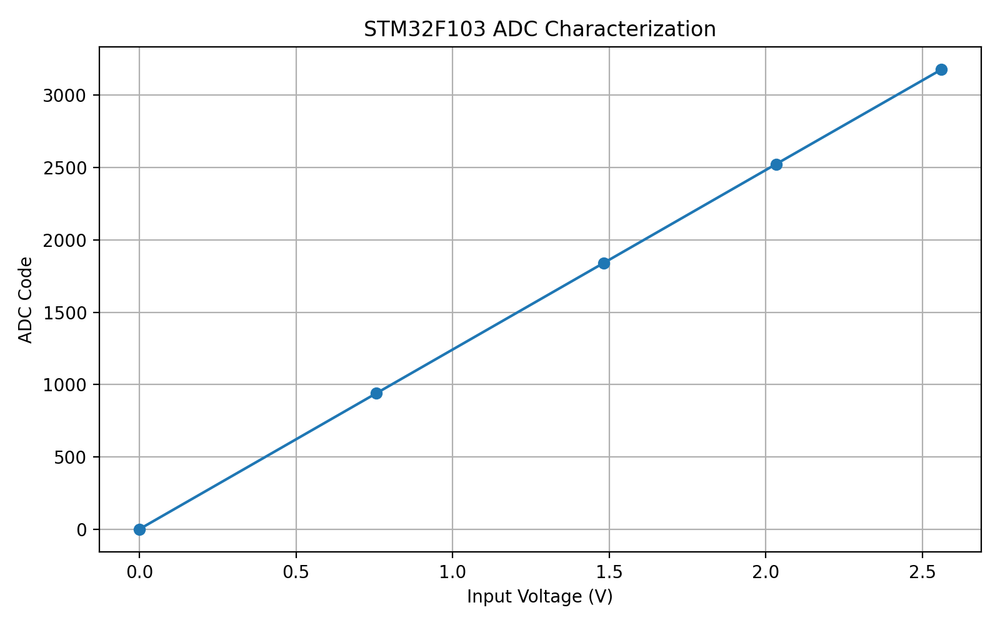
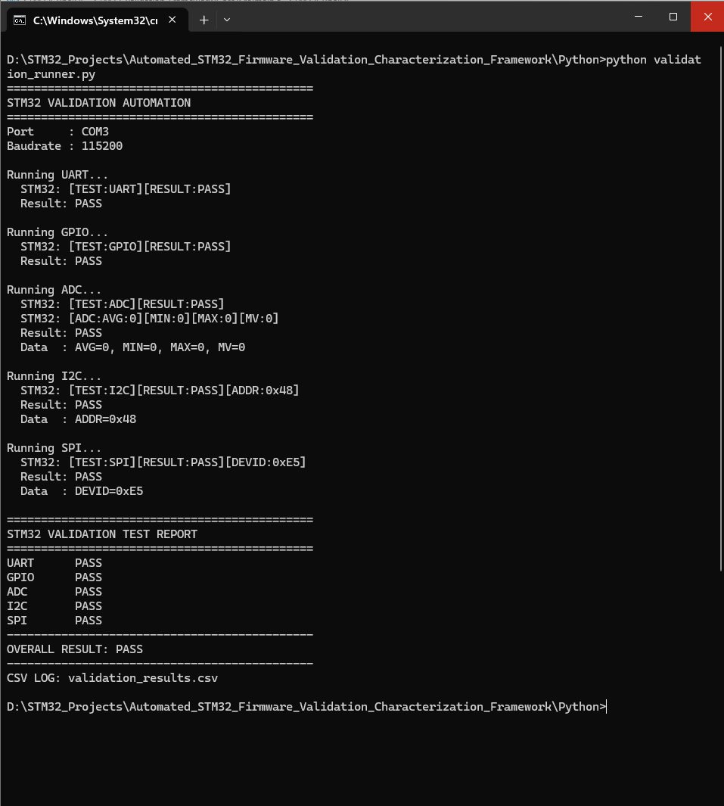
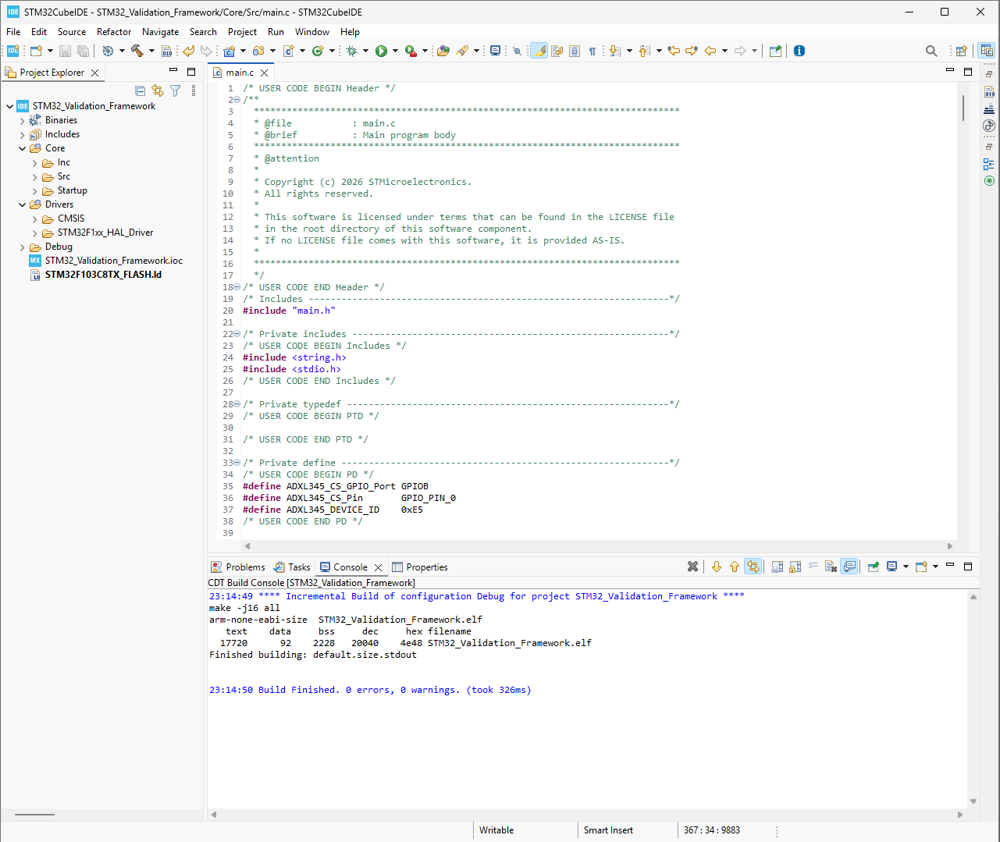
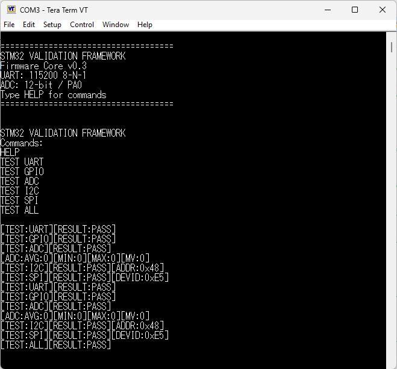
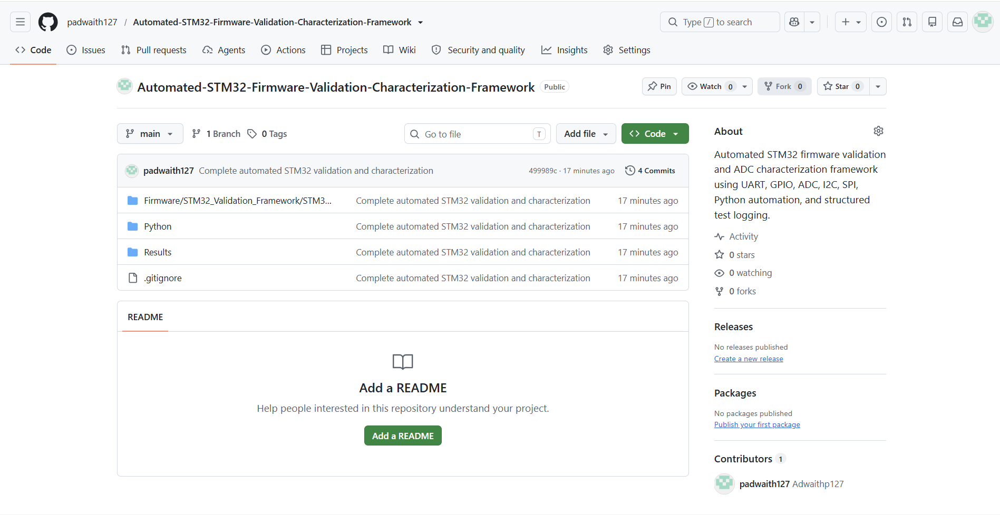

# Automated STM32 Firmware Validation & Characterization Framework

> An automated embedded firmware validation and characterization framework built around the **STM32F103C8T6 (Blue Pill)**.

This project combines **STM32 Embedded C firmware**, **UART-based command control**, and **Python/PySerial automation** to validate MCU peripherals, capture structured test results, and perform real ADC characterization.

---

## Project Status

| Area | Status |
|---|---|
| STM32 Firmware | ✅ Complete |
| UART Validation | ✅ PASS |
| GPIO Validation | ✅ PASS |
| ADC Validation | ✅ PASS |
| I2C Validation | ✅ PASS |
| SPI Validation | ✅ PASS |
| Python Automation | ✅ Complete |
| CSV Test Logging | ✅ Complete |
| Real ADC Characterization | ✅ Complete |
| GitHub Documentation | ✅ Complete |

---

## Project Overview

This project implements a practical hardware-validation workflow similar to an embedded firmware validation environment.

The STM32 firmware provides command-driven tests for:

- UART
- GPIO
- ADC
- I2C
- SPI

The Python automation layer communicates with the STM32 over UART and:

1. Executes peripheral validation tests
2. Captures STM32 responses
3. Determines PASS/FAIL status
4. Extracts measurement data
5. Generates CSV validation logs
6. Collects real ADC characterization data
7. Generates ADC characterization plots

---

## Key Results

| Test | Result | Measurement |
|---|---|---|
| UART | PASS | 115200 8-N-1 |
| GPIO | PASS | GPIO validation |
| ADC | PASS | 12-bit ADC |
| I2C | PASS | Device detected at `0x48` |
| SPI | PASS | ADXL345 ID `0xE5` |
| Overall | **PASS** | Automated validation |

### Automated Validation Result

```text
STM32 VALIDATION TEST REPORT
========================================
UART    PASS
GPIO    PASS
ADC     PASS
I2C     PASS
SPI     PASS
----------------------------------------
OVERALL RESULT: PASS
========================================
```

---

# System Architecture

```text
                    Python Automation
                           |
                           | PySerial
                           | COM3 / 115200
                           v
                +-----------------------+
                |    STM32F103C8T6      |
                |     Validation Core   |
                +-----------+-----------+
                            |
          +-----------------+-----------------+
          |                 |                 |
          v                 v                 v
        UART               ADC              GPIO
                            |
                            |
                 +----------+----------+
                 |                     |
                 v                     v
            I2C / ADS1115        SPI / ADXL345
```

---

# Hardware

| Component | Purpose |
|---|---|
| STM32F103C8T6 Blue Pill | Main MCU |
| CP2102 USB-to-TTL | UART communication |
| Potentiometer | ADC characterization |
| ADS1115 | I2C peripheral validation |
| ADXL345 | SPI peripheral validation |
| Breadboard | Hardware integration |
| Jumper wires | Connections |

---

## Hardware Setup



*Physical STM32 validation hardware setup used for peripheral validation and ADC characterization.*

# STM32 Peripheral Configuration

| Peripheral | Interface / Pin | Validation |
|---|---|---|
| USART1 | UART | Communication test |
| ADC1 | PA0 | ADC validation & characterization |
| GPIO | PC13 | GPIO validation |
| I2C1 | I2C | ADS1115 detection |
| SPI1 | SPI | ADXL345 device ID |

### UART Configuration

```text
Baudrate : 115200
Format   : 8-N-1
```

---

# Firmware Commands

The STM32 exposes a UART command interface.

```text
HELP
TEST UART
TEST GPIO
TEST ADC
TEST I2C
TEST SPI
TEST ALL
```

### Example STM32 Output

```text
[TEST:UART][RESULT:PASS]
[TEST:GPIO][RESULT:PASS]
[TEST:ADC][RESULT:PASS]
[ADC:AVG:3347][MIN:3339][MAX:3358][MV:2697]
[TEST:I2C][RESULT:PASS][ADDR:0x48]
[TEST:SPI][RESULT:PASS][DEVID:0xE5]
[TEST:ALL][RESULT:PASS]
```

---

# ADC Validation

The STM32 internal ADC is configured as:

```text
ADC        : ADC1
Channel    : Channel 0
Pin        : PA0
Resolution : 12-bit
Reference  : 3.3 V
```

The firmware reports:

- Average ADC code
- Minimum ADC code
- Maximum ADC code
- Calculated voltage

### Example

```text
[TEST:ADC][RESULT:PASS]
[ADC:AVG:3347][MIN:3339][MAX:3358][MV:2697]
```

---

# ADC Characterization

A potentiometer was used to generate multiple real input-voltage levels.

The Python collector captured the following measurements directly from the STM32 ADC.

| Point | ADC Average | ADC Min | ADC Max | Voltage |
|---:|---:|---:|---:|---:|
| 1 | 0 | 0 | 0 | 0 mV |
| 2 | 940 | 938 | 949 | 757 mV |
| 3 | 1841 | 1838 | 1846 | 1483 mV |
| 4 | 2524 | 2512 | 2535 | 2033 mV |
| 5 | 3177 | 3171 | 3183 | 2560 mV |

### ADC Characterization Curve



Dataset:

```text
Results/adc_characterization.csv
```

The measurements above are the recorded characterization data from the STM32 ADC using the potentiometer input.

---

# Python Automation

The Python automation layer uses **Python 3.11** and **PySerial**.

## Validation Runner

```text
Python/validation_runner.py
```

Runs:

```text
TEST UART
TEST GPIO
TEST ADC
TEST I2C
TEST SPI
```

and generates an overall validation result.

---

## ADC Collector

```text
Python/adc_collector.py
```

Collects real ADC measurements from the STM32 and stores them in CSV format.

---

## ADC Characterization

```text
Python/adc_characterization.py
```

Processes ADC characterization measurements.

---

## Graph Generator

```text
Python/generate_adc_graph.py
```

Generates the ADC characterization graph from the collected dataset.

---

# Automated Validation Output

Example Python execution:

```text
========================================
STM32 VALIDATION AUTOMATION
========================================

Port     : COM3
Baudrate : 115200

Running UART...
STM32: [TEST:UART][RESULT:PASS]
Result: PASS

Running GPIO...
STM32: [TEST:GPIO][RESULT:PASS]
Result: PASS

Running ADC...
STM32: [TEST:ADC][RESULT:PASS]
STM32: [ADC:AVG:3347][MIN:3339][MAX:3358][MV:2697]
Result: PASS
Data  : AVG=3347, MIN=3339, MAX=3358, MV=2697

Running I2C...
STM32: [TEST:I2C][RESULT:PASS][ADDR:0x48]
Result: PASS
Data  : ADDR=0x48

Running SPI...
STM32: [TEST:SPI][RESULT:PASS][DEVID:0xE5]
Result: PASS
Data  : DEVID=0xE5

========================================
STM32 VALIDATION TEST REPORT
========================================
UART    PASS
GPIO    PASS
ADC     PASS
I2C     PASS
SPI     PASS
----------------------------------------
OVERALL RESULT: PASS
========================================
CSV LOG: validation_results.csv
```

### Python Validation Evidence



---

# Structured CSV Logging

Validation results are stored in:

```text
Python/validation_results.csv
```

The log contains:

```text
timestamp
test_id
test_name
command
expected
actual
measurement
error
```

### Example

```csv
timestamp,test_id,test_name,command,expected,actual,measurement,error
2026-08-09T23:01:07,TEST_UART,UART,TEST UART,PASS,PASS,,
2026-08-09T23:01:07,TEST_GPIO,GPIO,TEST GPIO,PASS,PASS,,
2026-08-09T23:01:08,TEST_ADC,ADC,TEST ADC,PASS,PASS,"AVG=3339, MIN=3297, MAX=3346, MV=2690",
2026-08-09T23:01:08,TEST_I2C,I2C,TEST I2C,PASS,PASS,ADDR=0x48,
2026-08-09T23:01:09,TEST_SPI,SPI,TEST SPI,PASS,PASS,DEVID=0xE5,
```

---

# Validation Evidence

## STM32CubeIDE Build

Firmware build completed successfully with:

```text
0 errors
0 warnings
```



---

## STM32 UART / Peripheral Validation



---

## Python Automated Validation


---

## ADC Characterization


---

## GitHub Repository



---

# Project Structure

```text
Automated-STM32-Firmware-Validation-Characterization-Framework/
│
├── Firmware/
│   └── STM32_Validation_Framework/
│       └── STM32_Validation_Framework/
│           ├── Core/
│           │   ├── Inc/
│           │   └── Src/
│           ├── Drivers/
│           └── STM32_Validation_Framework.ioc
│
├── Python/
│   ├── validation_runner.py
│   ├── adc_collector.py
│   ├── adc_characterization.py
│   ├── generate_adc_graph.py
│   └── validation_results.csv
│
├── Results/
│   ├── adc_characterization.csv
│   ├── github_repository.png
│   ├── python_automated_validation_pass.png
│   ├── stm32_adc_characterization.png
│   ├── stm32_cubeide_build_success.png
│   └── stm32_uart_validation_pass.png
│
├── .gitignore
└── README.md
```

---

# Tools & Technologies

## Firmware

- Embedded C
- STM32 HAL
- STM32F103C8T6
- ARM Cortex-M3
- STM32CubeMX
- STM32CubeIDE
- STM32CubeProgrammer

## Communication

- UART
- I2C
- SPI

## Python

- Python 3.11
- PySerial
- CSV
- ADC data processing
- Data visualization

## Validation Tools

- Tera Term
- Git
- GitHub
- STM32CubeIDE
- STM32CubeProgrammer

---

# Development Workflow

```text
Hardware Setup
      ↓
STM32 Firmware Configuration
      ↓
Peripheral Initialization
      ↓
Peripheral Validation
      ↓
UART Command Interface
      ↓
Python Automation
      ↓
PASS / FAIL Evaluation
      ↓
CSV Logging
      ↓
ADC Characterization
      ↓
Graph Generation
      ↓
Git Version Control
      ↓
GitHub
```

---

# Git Development History

```text
7b092d4  Clean up README project header
0707720  Improve README with validation evidence
dc9271a  Add comprehensive project documentation
202d063  Add validation evidence and ADC characterization results
499989c  Complete automated STM32 validation and characterization
9fd46d0  Add I2C and SPI peripheral validation
1d2c46f  Add STM32 UART GPIO and ADC validation core
2f1db9d  Initial STM32 validation framework baseline
```

---

# Future Improvements

Potential future extensions include:

- ADC INL/DNL characterization
- ADC linearity and error analysis
- GPIO electrical characterization
- SPI/I2C timing validation
- Automated oscilloscope integration
- Logic analyzer integration
- HTML/PDF automated test reports
- Hardware-in-the-loop regression testing
- Timer/PWM validation
- CAN validation
- DAC validation
- Additional STM32 peripheral validation

These are future extensions and are **not claimed as currently implemented**.

---

# Project Outcome

The framework successfully demonstrates an automated STM32 validation workflow combining:

- Firmware bring-up
- Peripheral validation
- UART command control
- Python automation
- PASS/FAIL evaluation
- Structured CSV logging
- Real ADC characterization
- Data visualization
- Git version control
- GitHub documentation

### Final Automated Validation

```text
UART    PASS
GPIO    PASS
ADC     PASS
I2C     PASS
SPI     PASS

OVERALL RESULT: PASS
```

---

# Author

**Adwaith P**

B.Tech Electrical & Electronics Engineering  
NIT Calicut

GitHub: [padwaith127](https://github.com/padwaith127)
